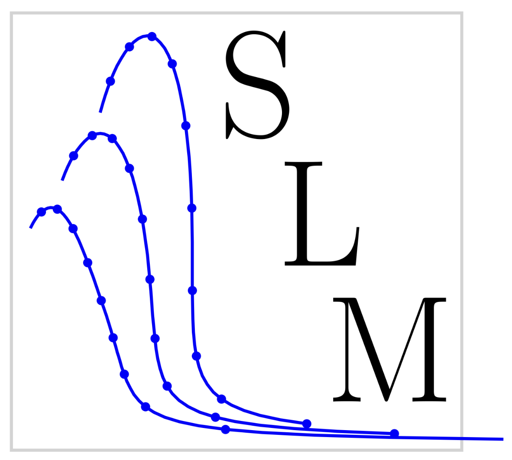

# Star Log-extended eMulation: SLM



Welcome to the Star Log-extended eMulation (SLM) package! Here we provide open source code for implementing the emulators we developed for the Tolman-Oppenheimer-Volkoff (TOV) equations. These include:

- The original SLM emulator that is capable of handling logarithmically nonlinear ordinary differential equations, e.g., the TOV equations including tidal deformability.
- A parametric extension of the original emulator, parametric SLM (pSLM) that is able to map between parameters of the equation of state (EOS) to the neutron star properties of mass, radius, and tidal deformability.

These emulators exhibit a computational speed-up of $\approx 10^{4}$ times that of the high fidelity (HF) TOV solver employing standard Runge-Kutta (RK) methods, enabling their use in computationally intensive Bayesian frameworks used by multi-messenger astrophysical collaborations, e.g., LIGO/VIRGO/KAGRA. These emulators can also be further developed for use outside of nuclear astrophysics---feel free to try extending them or using them on your own physics or mathematics problem of interest!

## Installation instructions

To install the most recent stable version of this package, run the command
```shell
pip install SLM
```

To install this package in developer mode, run the following:
```shell
git clone https://github.com/asemposki/SLM.git
cd SLM
pip install -e .
```

## Testing

To use the testing suite in this repository, go inside the `tests` folder and simply run the command
```shell
python3 -m pytest
```
to run all of the tests at once. To run an individual test, use the command
```shell
python3 pytest <testing file name>
```
inside of the `tests` folder.

## Citing this package

```bibtex
@article{Lalit:2024xxx,
    author = "Lalit, Sudhanva and Semposki, Alexandra C. and Maldonado, Joshua M.",
    title = "{Star Log-extended eMulation: a method for efficient computation of the Tolman-Oppenheimer-Volkoff equations}",
    eprint = "2411.xxxxx",
    archivePrefix = "arXiv",
    primaryClass = "astro-ph",
    month = "11",
    year = "2024"
}
```

## Author contact information
- Sudhanva S. Lalit (FRIB/MSU): lalit@frib.msu.edu
- Alexandra C. Semposki (Ohio U): as727414@ohio.edu
- Joshua M. Maldonado (Ohio U): jm998521@ohio.edu
